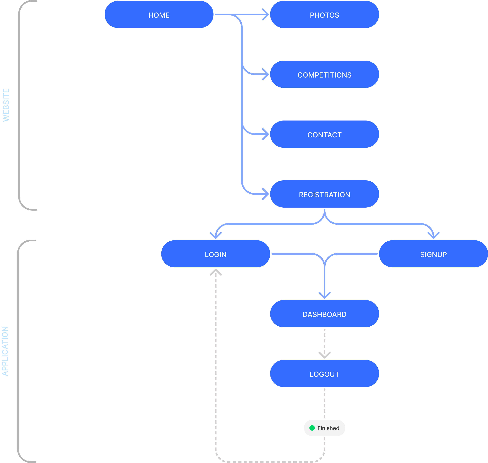

<h1 align="center">Galielei Is Nao • <a href="https://www.galileiisnao.it/" target="_blank">Gali's website</a></h1>

<p align="center">
    <a href="#overview">Overview</a> |
    <a href="#development">Development</a>
</p>

<p align="center">  
    
</p>

___

## Overview
Questo repository contiene il codice sorgente per il nuovo sito [NAO](https://www.galileiisnao.it/) . Il sito è scritto utilizzando [Angular](https://angular.io/), [TypeScript](https://www.typescriptlang.org/) e css.

Il sito permette di interfacciarsi direttamente con il sistema di e-commerce oltre ad avere un aggiornamento in tempo reale delle operazioni del Nao.
Il l'amministratore ha inoltre una pagina dedicata in cui potrà visualizzare dei dati analitici in real-time.

Il sito ha infine una funzione di manifesto, infatti raccoglie foto di competizioni passate.

## Development
1. **Clona la repository**:
    ```ps
    git clone https://github.com/GalileiIsNao-2024/website.git && cd website
    ```
    Ciò creerà una copia locale di questo repository e ti porterà alla cartella principale del repository.

2. Installa le dipendenze
    ```ps
    npm i
    ```

3. Esegui lo script
    ```ps
    ng serve
    ```

## Codebase Structure
```
/website
│
├── /php
│   ├── /auth
│   │   ├── session.php
│   │   └── user.class.php
│   └── db_connection.php
│
├── /src
│   ├── /app
│   │   ├── /app
│   │   │   ├── /components
│   │   │   │   └── /header
│   │   │   │
│   │   │   └── /pages
│   │   │       ├── /signin
│   │   │       ├── /signup
│   │   │       └── /dashboard
│   │   │
│   │   ├── /website
│   │   │   ├── /components
│   │   │   │   ├── /header
│   │   │   │   └── /footer
│   │   │   │
│   │   │   └── /pages
│   │   │       ├── /index
│   │   │       ├── /photos
│   │   │       └── /competitions
│   │   │
│   │   ├── app.component.html
│   │   ├── app.component.css
│   │   ├── app.component.spec.ts
│   │   └── app.component.ts
│   │
│   ├── /assets
│   │   ├── /avatars
│   │   ├── /icons
│   │   ├── /img
│   │   └── /photos
│   │
│   ├── index.html
│   ├── main.ts
│   └── styles.css
│
├── angular.json
├── tsconfig.json
├── package.json
└── tsconfig.spec.json

```

### Application Routing
```
{
    "/"                → home
    "/photos"          → raccolta foto
    "/competitions"    → descrizioni di competizioni precedenti
    "/singin"          → accesso
    "/singup"          → registrazione
    "/dashboard"       → tabella e grafici dei dati
}
```

## Userflow
<p align="center">  
    
</p>


# Thanks for scrolling!
<p align="center">  
    
</p>
